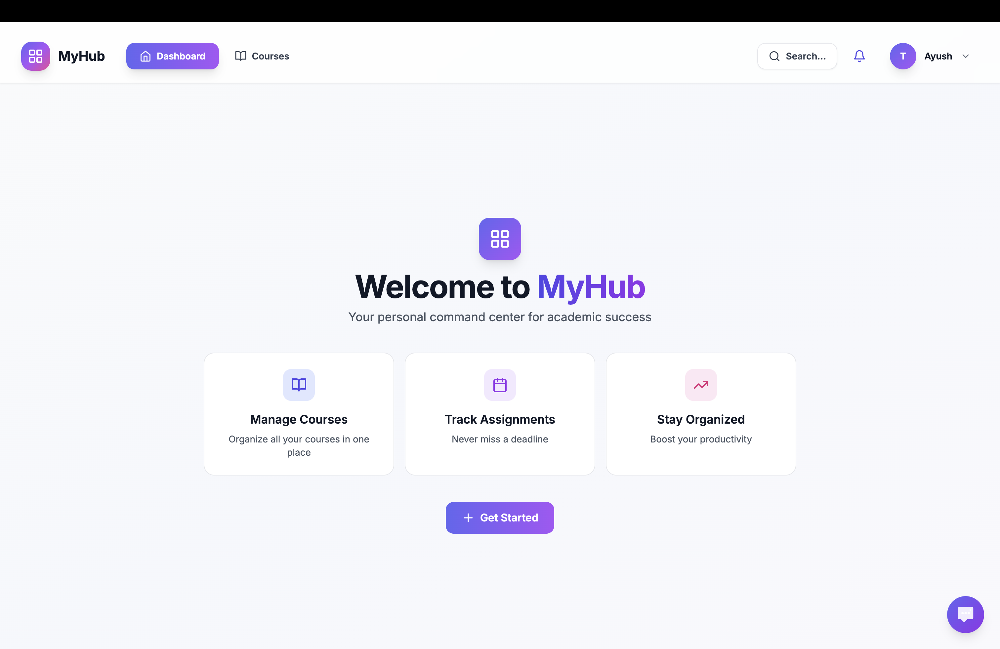
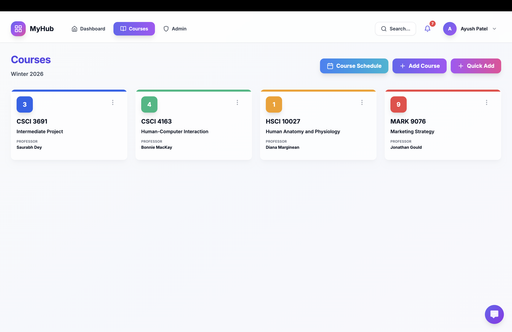
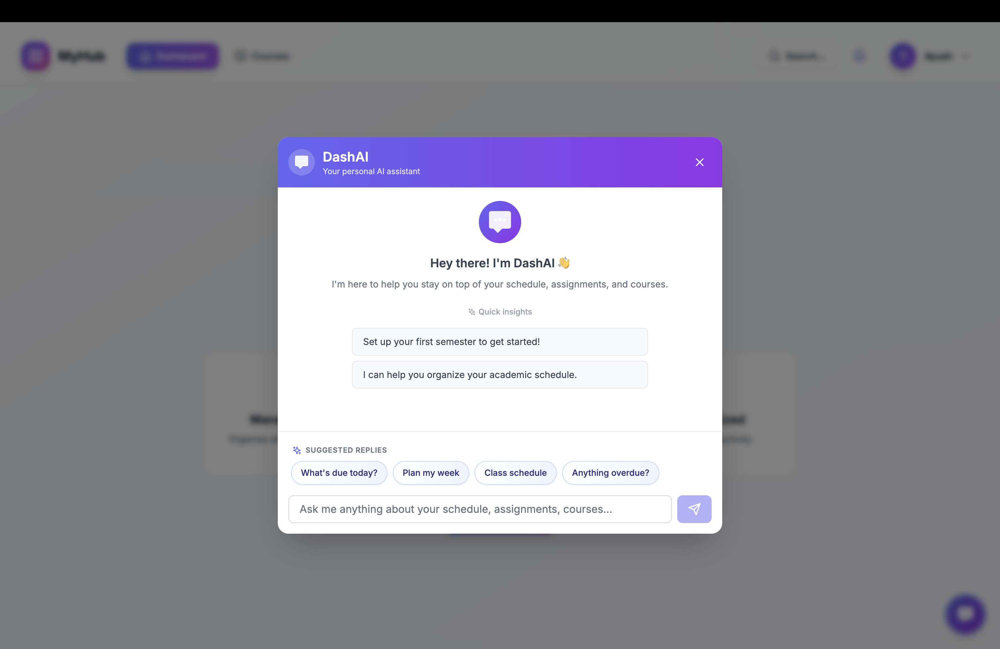

# MyHub - Personal Dashboard Project

A smart, modern personal dashboard for managing your life - starting with academic courses and assignments, with room to grow.

## Preview

<p>
  
</p>

<p>
  
</p>

<p>
  
</p>

## Features

- 📚 Course management with color coding
- 📝 Fast assignment tracking (add in < 30 seconds)
- 📅 Dashboard with today's schedule and upcoming deadlines
- 🔄 Recurring assignment templates
- 📱 Progressive Web App (works offline, installable)
- 🌙 Dark mode support
- 🔍 Search and filter functionality
- ⚡ Real-time sync across devices

## Tech Stack

- React 18 + TypeScript
- Vite
- Tailwind CSS
- Firebase (Auth, Firestore)
- PWA capabilities

## Getting Started

1. Install dependencies:
```bash
npm install
```

2. Set up Firebase:
   - Create a Firebase project at https://console.firebase.google.com
   - Copy your Firebase config to `src/config/firebase.ts`

3. Run development server:
```bash
npm run dev
```

4. Build for production:
```bash
npm run build
```

## Project Structure

```
src/
  ├── components/     # Reusable UI components
  ├── pages/         # Page components
  ├── hooks/         # Custom React hooks
  ├── services/      # Firebase and API services
  ├── types/         # TypeScript type definitions
  ├── utils/         # Utility functions
  └── config/        # Configuration files
```

## License

Personal project - Ayush Patel.

